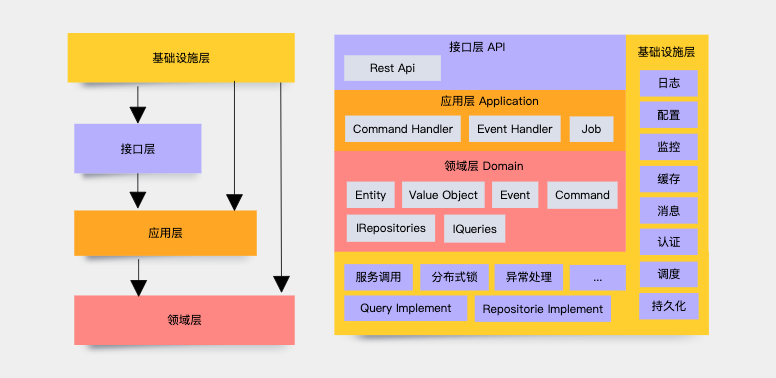

# Readme

## 1. 项目结构


## 2. 运行项目

### 2.1 基于配置文件
### 2.1.1 运行WebApi
``` SHELL
dotnet run --project ./src/myapp.API
```

### 2.1.2 运行Worker
``` SHELL
dotnet run --project ./src/myapp.Worker
```

### 2.2 基于配置中心
### 2.2.1 运行WebApi
``` SHELL
export Apollo_AppId=csharp-example
export Apollo_Cluster=default
export Apollo_MetaServer=http://test.apollo-configservice.service.consul:8080
export Apollo_Secret=
dotnet run --project ./src/myapp.API
```

### 2.2.2 运行Worker
``` SHELL
export Apollo_AppId=csharp-example
export Apollo_Cluster=default
export Apollo_MetaServer=http://test.apollo-configservice.service.consul:8080
export Apollo_Secret=
dotnet run --project ./src/myapp.Worker
```

## 3. 构建项目

* Windows
``` SHELL
ci-build-linux-x64.cmd
```

* Linux/Mac
``` SHELL
ci-build-linux-x64.sh
```


## 4. 编辑项目
请使用VSCode 或者 VisualStudio

## 5. 项目组件
https://github.com/guoming/Hummingbird
